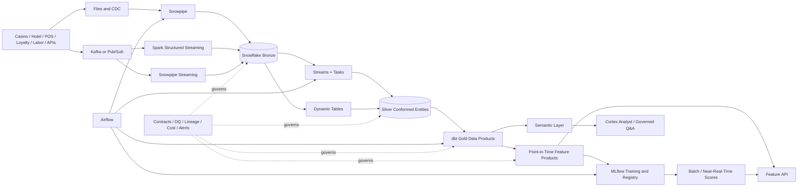

# Casino Snowflake Streaming & AI Platform

[](https://github.com/mrdata355/casino-snowflake-streaming-ai-platform/actions/workflows/ci.yml)
[](https://github.com/mrdata355/casino-snowflake-streaming-ai-platform/actions/workflows/security.yml)

An end-to-end data and AI platform for casino and resort analytics. The platform ingests transactional and high-frequency event data, builds governed Snowflake lakehouse products, publishes point-in-time ML features, serves versioned model scores, and supports role-aware conversational analytics.

All data, identities, and infrastructure names in this repository are synthetic. This is an independent engineering project and is not affiliated with or deployed by a casino operator.

## Platform capabilities

- Snowflake architecture: Snowpipe, Snowpipe Streaming, Streams, Tasks, Dynamic Tables, VARIANT, Time Travel, cloning, RBAC, masking, row-access policies, resource monitors, and query-cost controls.
- Streaming processing: Kafka and Pub/Sub ingestion, Spark Structured Streaming, event-time windows, watermarks, deduplication, checkpoint recovery, dead-letter handling, replay, and idempotent sinks.
- DataOps: Airflow, dbt, Terraform, GitHub Actions, data contracts, automated testing, observability, runbooks, backfills, incident response, and controlled promotion.
- AI and ML enablement: point-in-time feature products, leakage prevention, MLflow, governed scoring outputs, drift checks, feature APIs, and Cortex semantic consumption.
- Scale validation: staged 10 GB, 100 GB, and 1 TB Snowflake benchmarks with query tagging, transient data, automatic cleanup, measured evidence, and a clearly labeled 10 TB projection.
- Casino analytics: gaming revenue, slot utilization, player value, offer attribution, labor efficiency, and location profitability.

## Architecture



## Business data products

| Product | Grain | Primary use |
|---|---|---|
| `gold.fact_game_revenue_daily` | property + location + game + gaming day | Certified net gaming revenue |
| `gold.fact_slot_performance_5min` | machine + five-minute event window | Utilization, faults, jackpots, anomaly features |
| `gold.mart_location_profitability` | property + location + business date | Revenue, labor, offers, direct costs, ROI |
| `feature.fp_player_value_daily` | player + analysis date | Churn, reactivation, next-best-offer, player value |
| Semantic view | governed dimensions and metrics | Cortex Analyst and conversational consumption |

## Repository map

```text
snowflake/      Native DDL, ingestion, CDC, dynamic tables, security and semantic objects
dbt/            Staging, Silver, Gold, feature, snapshot, contract and business-rule models
spark/          Streaming and backfill jobs with replay-safe Snowflake writes
ingestion/      API, Kafka, Pub/Sub and Snowpipe Streaming clients
airflow/        Batch, publication-gate and ML feature workflows
ml/             Training, scoring and drift-monitoring examples
services/       Governed feature/score API and Cortex client
terraform/      Repeatable Snowflake environment provisioning
contracts/      JSON Schema contracts and ownership metadata
benchmarks/     Credential-free scale planning, SQL rendering and controlled execution
observability/  Data-quality, health, freshness and cost-monitoring SQL
docs/           Architecture decisions, mappings, operations and setup documentation
tests/          Contract, unit, integration, reconciliation and business-formula tests
```

## Quick start

### Prerequisites

- Python 3.11+
- Docker and Docker Compose
- Terraform
- A Snowflake account only for cloud execution; local tests do not require credentials

```bash
git clone https://github.com/mrdata355/casino-snowflake-streaming-ai-platform.git
cd casino-snowflake-streaming-ai-platform
cp .env.example .env
make bootstrap
make validate
make local-up
python scripts/generate_sample_events.py --count 100 --out /tmp/slot_events.jsonl
bash scripts/create_kafka_topics.sh
make test
```

See [Getting started](docs/getting_started.md) for local execution, Snowflake configuration, and deployment procedures.

## Scale validation

Plan and render the first benchmark without cloud credentials:

```bash
make benchmark-plan TARGET_GB=10 BENCHMARK_RUN_ID=SCALE_10GB_TRIAL
make benchmark-render TARGET_GB=10 BENCHMARK_RUN_ID=SCALE_10GB_TRIAL
make benchmark-test
```

Cloud execution is intentionally separate and requires an explicit confirmation flag. Follow the complete [scale benchmark protocol](docs/benchmarks/README.md) before creating any large Snowflake tables. Generated data and local benchmark reports remain outside Git.

## Engineering invariants

- Writes are idempotent, transactional, or protected by deterministic keys.
- Data products declare grain, owner, SLA, contract, lineage, quality checks, and recovery procedures.
- Backfills use bounded intervals, isolated checkpoints, reconciliation, and safe merge behavior.
- Player PII is masked and property-level access is filtered by policy.
- ML features are point-in-time correct; model outputs carry model version, feature timestamp, score timestamp, and trace metadata.
- Cortex access is semantic, role-aware, evaluated, and audited rather than exposing unrestricted raw tables.
- DEV, QA, and PROD use separate configuration and controlled promotion.

## End-to-end data flow

1. Generate synthetic slot events, including duplicates, late events, and malformed records.
2. Publish events to Kafka or Pub/Sub.
3. Process valid events through Spark Structured Streaming with checkpointing and watermarks.
4. Route invalid records to a dead-letter path.
5. Land immutable raw events in Bronze.
6. Conform and deduplicate Silver entities.
7. Publish five-minute slot performance and daily profitability products.
8. Build point-in-time player features and versioned model scores.
9. Serve approved features and scores through FastAPI.
10. Query certified business definitions through the semantic layer.

## Documentation

- [Getting started](docs/getting_started.md)
- [Platform components](docs/platform_components.md)
- [Scale benchmark protocol](docs/benchmarks/README.md)
- [Scale benchmark report template](docs/benchmarks/report_template.md)
- [Architecture](docs/architecture.md)
- [Source-to-target mapping](docs/source_to_target.md)
- [Production runbook](docs/runbook.md)
- [Architecture decision records](docs/adr/0001-native-vs-external-orchestration.md)
- [Security policy](SECURITY.md)
- [Contribution workflow](CONTRIBUTING.md)

## Security

Never commit credentials, private keys, account identifiers, production data, or `.env` files. Use key-pair authentication, GitHub Environments, short-lived identity where available, and an approved secret manager. See [SECURITY.md](SECURITY.md).

## Maintainer

Designed and maintained by Kellon Lewis (`@mrdata355`).

## License

MIT. See [LICENSE](LICENSE).
